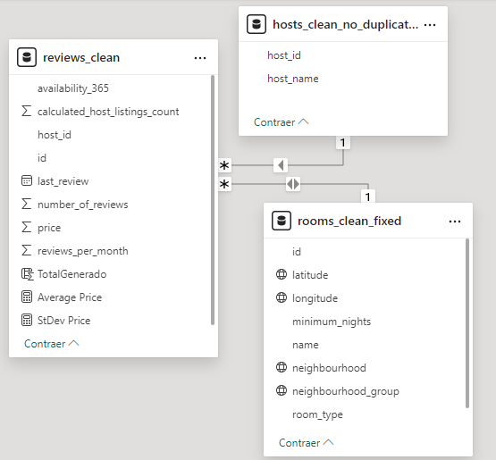
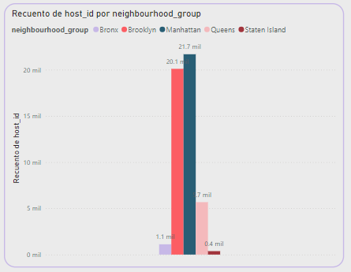
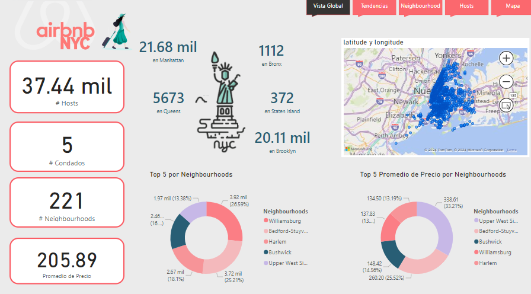

   # Proyecto_BI

   

   ## Objetivo 
   Analizar y explorar los datos relacionados con la disponibilidad de habitaciones en Airbnb utilizando herramientas y técnicas de Business Intelligence (BI), con el fin de:

   1. **Identificar patrones y tendencias** en la ocupación y disponibilidad de alojamientos, considerando factores como temporada, ubicación y precios.
   2. **Optimizar la disponibilidad de habitaciones** para maximizar la eficiencia operativa y los ingresos tanto para los anfitriones como para la plataforma.
   3. **Mejorar la toma de decisiones estratégicas** mediante la extracción de información valiosa que ayude a los anfitriones y a Airbnb a mejorar la experiencia del usuario y aumentar la rentabilidad.
   Este análisis busca generar insights que permitan una gestión más eficaz de los alojamientos y una mejor experiencia en la plataforma.

   ## Resumen de Preprocesamiento de Datos

   El dataset original contenía columnas desordenadas, con campos importantes como `host_id`, `host_name`, `name`, `neighbourhood_group` y `neighbourhood` fuera de lugar. Para resolver este problema, se unieron múltiples tablas, lo que permitió identificar patrones y reorganizar los datos adecuadamente utilizando Python. Este paso de preprocesamiento aseguró un dataset estructurado, preparando el terreno para análisis posteriores, incluyendo la detección de valores nulos y duplicados, que guiarán las próximas decisiones.

   # Manejo e Imputación de Valores Faltantes en Dataset de Airbnb

   Este script carga un dataset de Airbnb desde un archivo CSV y realiza varias transformaciones y estrategias de imputación de datos nulos.

   ## Manejo de Nulos en `name`, `host_name`, y `room_type`

   1. **Asignación de Valores**: En las columnas `name`, `host_name`, y `room_type`, se intentó primero asignar un valor basado en la información disponible. Si no se pudo hacer esta asignación, los valores faltantes (`NaN`) fueron imputados con el valor `'unknown'`. Esta estrategia permite que los registros incompletos sean procesados sin eliminar información crítica.

   2. **Asignación de Tipos de Habitación**: En los casos donde la columna `room_type` estuviera vacía, se intentó clasificar automáticamente la propiedad según palabras clave presentes en el nombre del anuncio. Las categorías posibles fueron:
      - `Entire home/apt` (casa o apartamento entero),
      - `Private room` (habitación privada),
      - `Shared room` (habitación compartida).

      Si no fue posible determinar el tipo de habitación basado en esta información, se imputó el valor `'unknown'`. Esto ayudó a mejorar la clasificación de las propiedades sin depender exclusivamente de la información de los anfitriones.

   ## Imputación de Valores Faltantes en `last_review`

   La columna `last_review`, que registra la fecha de la última reseña, fue transformada al formato de fecha (`datetime`). Para los valores nulos, se utilizó la mediana de las fechas existentes en la columna, asegurando que las propiedades con reseñas faltantes recibieran un valor coherente con la distribución temporal del dataset.

   ## Corrección e Imputación de `reviews_per_month`

   Para la columna `reviews_per_month`, los valores nulos fueron imputados utilizando la mediana de los valores válidos en esta columna.

   ## Imputación de Valores Faltantes en `number_of_reviews`

   Para la columna `number_of_reviews`, que registra el número total de reseñas, se implementó una imputación de valores faltantes basada en:

   - **Fecha de la Última Reseña** (`last_review`): Se utilizó la fecha de la última reseña para determinar el período de actividad de la propiedad.
   - **Promedio de Reseñas Mensuales** (`reviews_per_month`): Con este dato se calculó cuántas reseñas pudo haber recibido una propiedad durante el tiempo en que estuvo activa.

   El proceso para la imputación fue el siguiente:
   1. Se calculó el número de meses entre una fecha de inicio predefinida (1 de enero de 2020) y la fecha de la última reseña (`last_review`).
   2. Este número de meses se multiplicó por el promedio de reseñas mensuales (`reviews_per_month`) para imputar el valor faltante de `number_of_reviews`.

   Esta técnica asegura que las propiedades con datos faltantes en `number_of_reviews` obtengan un valor estimado basado en su actividad histórica.

   ## Imputación de `price` usando `neighbourhood` y `neighbourhood_group`

   Para la columna `price`, los valores faltantes fueron imputados utilizando la mediana de los precios en función de las columnas `neighbourhood` y `neighbourhood_group`. En primer lugar, se intentó imputar el valor de `price` usando la mediana de precios por `neighbourhood`. Si no había suficiente información en esa categoría, se recurrió a la mediana de `neighbourhood_group`. Este enfoque asegura que los precios faltantes se imputen de forma coherente con las características del vecindario o grupo de vecindarios.

   ## Recuento Final de Valores Nulos

   Al final del proceso de imputación, se verificó la cantidad de valores nulos restantes en las columnas clave, asegurando que se haya minimizado la pérdida de información.

   ## Manejo de Duplicados

   En cuanto al manejo de duplicados en el dataset, se identificó que la columna `host_id` puede tener valores duplicados, ya que un mismo anfitrión puede listar múltiples propiedades. Sin embargo, cada cliente cuenta con un `id` único, lo que asegura que no haya duplicados en términos de clientes. 

   Otras variables dentro del dataset también pueden tener valores duplicados, pero se determinó que esto no afecta el análisis o la calidad de los datos, por lo que estos duplicados se mantendrán sin modificaciones.

   ## Identificación y Manejo de Datos Discrepantes en Variables Categóricas

   1. **Capitalización de Nombres**: Para mejorar la homogeneidad de los datos, la columna `name` fue transformada de manera que solo la primera letra de cada palabra esté en mayúscula. Esto asegura una presentación más consistente de los nombres de las propiedades.

   2. **Eliminación de Valores Extraños**: Se identificaron y eliminaron valores extraños o incoherentes en la columna `name`, manteniendo únicamente entradas válidas y mejorando así la calidad de los datos.

   ## Integración y Relación de Datos en PowerBI

   En el proceso de integración de datos utilizando PowerBI, se llevó a cabo una comprobación de los tipos de datos en las tablas limpias y se establecieron relaciones entre ellas para facilitar el análisis y visualización.

   ### Tablas y Relaciones
   
   - **Tablas Involucradas**:
   1. `hosts_clean`: Contiene información sobre los anfitriones.
   2. `rooms_clean`: Almacena detalles específicos de las habitaciones o propiedades.
   3. `reviews_clean`: Incluye información relacionada con las reseñas y evaluaciones.

   - **Relaciones Establecidas**:
   - `hosts_clean` y `reviews_clean` están relacionadas a través del campo `host_id`.
   - `rooms_clean` y `reviews_clean` están conectadas mediante el campo `id`, asegurando una relación directa entre la propiedad y sus reseñas.

   ## Análisis Exploratorio

   ## Conclusiones

   ### 1. Distribución Geográfica de Anfitriones

   

   La mayoría de los anfitriones están en **Manhattan**, seguido por **Brooklyn**. Esto subraya que estos barrios no solo tienen la mayoría de las propiedades, sino también la mayor cantidad de anfitriones activos, lo que puede indicar una competitividad más alta en estas áreas.

   ### 2. Distribución de Tipos de Habitaciones por Vecindario

   
   **Manhattan** tiene un mayor porcentaje de apartamentos/casas enteras disponibles, mientras que en otros vecindarios como **Brooklyn** y **Queens**, las habitaciones privadas tienen una representación significativa. Esto puede reflejar diferencias en el tipo de viajeros que visitan cada área o en las restricciones locales de alquiler.

   ### 3. Disponibilidad y Precios

   

   Hay variaciones significativas en la disponibilidad y los precios a lo largo del año, que podrían ser explotadas para maximizar la rentabilidad. Por ejemplo, los precios en **Manhattan** se disparan durante ciertos meses, lo cual puede estar relacionado con eventos específicos o temporadas turísticas altas.

   ## Recomendaciones

   ### 1. Optimización de Precios por Temporada y Vecindario

   Implementar estrategias de precios dinámicos basadas no solo en la temporada, sino también en eventos locales importantes que puedan aumentar la demanda temporalmente.

   ### 2. Marketing Segmentado

   Considerar campañas de marketing diferenciadas que apunten a los tipos de viajeros más comunes en cada vecindario. Por ejemplo, campañas orientadas a viajeros de negocios en **Manhattan** y a turistas económicos en **Queens**.

   ### 3. Análisis de Competencia Local

   Dado que hay una gran cantidad de anfitriones en áreas clave, analizar qué están ofreciendo otros anfitriones en términos de comodidades y precios para asegurarte de ser competitivos.

   ### 4. Diversificación de Ofertas

   En áreas con alta concentración de habitaciones privadas, considerar ofrecer servicios adicionales o experiencias únicas para diferenciarse de la competencia.

   ## Recursos

   ## Dashboard 
   
   Puedes acceder a mi dashboard de Power BI haciendo clic [aquí](pdf/Dashboardpowerbi.pdf).
